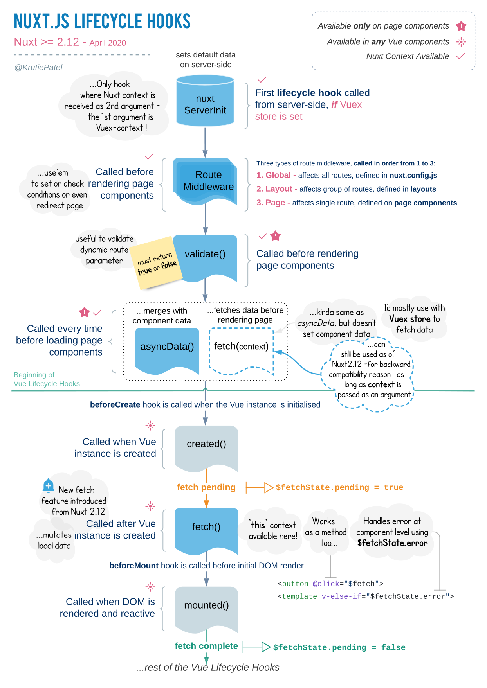

# Nuxt ライフサイクル

どのツールを使う場合でも、ツールが内部でどのように機能するかを理解すると常に自信が持てるようになります。同じことが Nuxt にも当てはまります。

---

この章の目的は、フレームワークのさまざまな部分とそれらの実行順序、およびどのように連携するかについての概要を説明することです。

Nuxt ライフサイクルはアプリケーションがバンドルされ、チャンク化され、縮小されるビルドフェーズの後に何が起こるかを説明します。このフェーズの後に何が起こるかは、サーバーサイドのレンダリングが有効になっているかどうかによって異なります。有効になっている場合は、選択したサーバーサイドレンダリングのタイプによってさらに異なります:

動的な SSR（`nuxt start`）

または、静的サイト生成（`nuxt generate`）

## ライフサイクル

### サーバー

SSR の場合、これらのステップはアプリケーションへの最初のリクエストごとに実行されます。

- サーバーを起動します（`nuxt start`）

静的サイトの生成を行う場合、サーバーステップはビルド時にのみ実行されますが、生成されるページごとに 1 回実行されます。

- 生成処理を開始します（`nuxt generate`）

- Nuxt フック
- サーバーミドルウェア
- サーバーサイドの Nuxt プラグイン
  - nuxt.config.js で定義されている順序
- nuxtServerInit
  - ストアに事前にデータを詰めるためにサーバーサイドでのみ呼び出される Vuex アクション
  - 第 1 引数は **Vuex context**、 第 2 引数は **Nuxt context** です
    - ここから他のアクションをディスパッチします → サーバーサイドの後続ストアアクションの「エントリポイント」のみです
  - `store/index.js` でのみ定義できます
- ミドルウェア
  - グローバルミドルウェア
  - レイアウトミドルウェア
  - ルートミドルウェア
- asyncData
- beforeCreate（Vue ライフサイクルメソッド）
- created（Vue ライフサイクルメソッド）
- 新しい fetch（上から下、ノード = 並列）
- 状態のシリアライズ（`render:routeContext` Nuxt フック）

- HTML レンダリングの開始（`render:route` Nuxt フック）

- `render:routeDone` フック、HTML がブラウザに送信されたとき

- `generate:before` Nuxt フック
- HTML ファイルの生成
  - **完全な静的生成**
    - 例えば静的ペイロードが抽出された場合
  - `generate:page`（HTML が編集可能）
  - `generate:routeCreated`（ルートが生成されます）
- `generate:done` すべての HTML ファイルが生成されたとき

### クライアント

ライフサイクルのこの部分は選択した Nuxt モードに関係なくブラウザーで完全に実行されます。

- HTML を受け取り
- アセットのロード（例えば JavaScript）
- Vue ハイドレーション
- ミドルウェア
  - グローバルミドルウェア
  - レイアウトミドルウェア
  - ルートミドルウェア
- クライアントサイド Nuxt プラグイン
  - nuxt.config.js で定義されている順序
- asyncData（ブロッキング）
- beforeCreate（Vue ライフサイクルメソッド）
- created（Vue ライフサイクルメソッド）
- あたらしい fetch（上から下、ノード = 並列）（ノンブロッキング）
- beforeMount（Vue ライフサイクルメソッド）
- mounted（Vue ライフサイクルメソッド）

### NuxtLink コンポーネントを使って遷移する

_クライアント_ の章と同様に `<NuxtLink>` を介して遷移する場合だけすべてのステップがブラウザで発生します。さらにすべての _ブロッキング_ タスクが実行されるまでページコンテントは表示されません。

#### Info
[`<NuxtLink>`](./features/nuxt-components#the-nuxtlink-component) のドキュメントで詳細を確認してください

- ミドルウェア
  - グローバルミドルウェア
  - レイアウトミドルウェア
  - ルートミドルウェア
- asyncData（ブロッキング）
- asyncData（ブロッキングまたは完全静的なペイロードをロードします）
- beforeCreate & created（Vue ライフサイクルメソッド）
- fetch（ノンブロッキング）
- beforeMount & mounted

## この次は？

#### Next
[機能](./features/rendering-modes) について確認しましょう。

<a href="../index.html#toc">Go to TOC</a>
