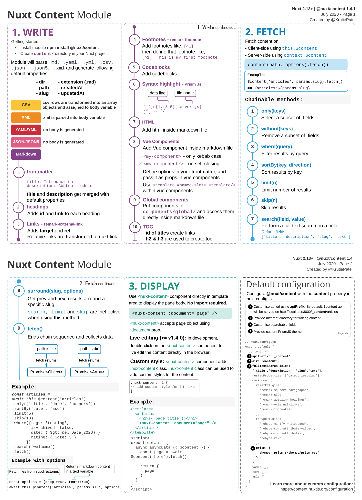

# コンテンツディレクトリ

`@nuxt/content` モジュールを使うことで Nuxt アプリケーションを強化できます。このモジュールは `content/`  ディレクトリへの書き込みや、**Git ベースのヘッドレス CMS** のように動作する MongoDB のような API を介してマークダウン、JSON、YAML や CSV ファイルを取得できます。

---



### 開発時のホットリロード

マークダウンファイルに変更があった場合 webpack を介する必要がないので、開発時における content モジュールのホットリロードは非常に高速です。また、`content:update` イベントのリッスンやプラグインを作ることもできるので content 内のファイルを更新するたびに例えば fetchCategories メソッドをディスパッチすることができます。

#### Next
詳細は [content モジュールのドキュメントのホットリロードの取り扱い](https://content.nuxtjs.org/advanced#handling-hot-reload)を参照してください


### content の表示

ページの本文を表示するために `<nuxt-content>` コンポーネントをテンプレートで直接使えます。

```html{}[pages/blog/_slug.vue]
<template>
  <article>
    <nuxt-content :document="article" />
  </article>
</template>
```

#### Next
詳細は [content モジュールのドキュメントのコンポーネント](https://content.nuxtjs.org/displaying#component) を参照してください。


### content のスタイリング

アプリケーションの設計に使っているものによってはマークダウンを適切に表示するために何らかのスタイルを作成する必要があるかもしれません。

`<nuxt-content> ` コンポーネントは自動的に `.nuxt-content` class を追加します。この class を使ってスタイルをカスタマイズできます。

```html
<style>
  .nuxt-content h2 {
    font-weight: bold;
    font-size: 28px;
  }
  .nuxt-content p {
    margin-bottom: 20px;
  }
</style>
```

#### Next
詳細は [content モジュールのドキュメントのスタイル](https://content.nuxtjs.org/displaying#style)を参照してください。


### マークダウン、CSV、YAML、JSON（5）を扱う

このモジュールは .md ファイルを JSON AST ツリー構造に変換し body 変数に格納します。YAML front matter ブロックをマークダウンファイルまたはドキュメントに挿入される .yaml ファイルに追加することもできます。また、同様にドキュメントに挿入できる json/json5 ファイルや行が body 変数に割り当てられる .csv ファイルを追加することもできます。

```md
---
title: My first Blog Post
description: Learning how to use @nuxt/content to create a blog
---
```

#### Next
詳細は [content モジュールのドキュメントのマークダウン](https://content.nuxtjs.org/writing#markdown)を参照してください。


### マークダウン内の Vue コンポーネント

マークダウンファイルで Vue コンポーネントを直接使えます。ただし、コンポーネントをケバブケースで参照する必要があり自動終了タグは使えません。

```html{}[components/global/InfoBox.vue]
<template>
  <div class="p-4 mb-4 text-white bg-blue-500">
    <p><slot name="info-box">default</slot></p>
  </div>
</template>
```

```html{}[content/articles/my-first-blog-post.md]
<info-box>
  <template #info-box>
    This is a vue component inside markdown using slots
  </template>
</info-box>
```

#### Next
詳細は [content モジュールのドキュメントの vue コンポーネント](https://content.nuxtjs.org/writing#vue-components)を参照してください。


### 完全検索可能な API

`$content()` を使って content を簡単に一覧表示したりフィルタしたり検索したりできます。

```html{}[pages/blog/index.vue]
<script>
  export default {
    async asyncData({ $content, params }) {
      const articles = await $content('articles', params.slug)
        .only(['title', 'description', 'img', 'slug', 'author'])
        .sortBy('createdAt', 'asc')
        .fetch()

      return {
        articles
      }
    }
  }
</script>
```

#### Next
詳細は [content モジュールのドキュメントのメソッド一覧](https://content.nuxtjs.org/fetching#methods)を参照してください。


### 前の記事と次の記事

content モジュールには `.surround(slug)` が含まれているので前の記事と次の記事を簡単に取得できます。

```js
async asyncData({ $content, params }) {
    const article = await $content('articles', params.slug).fetch()

    const [prev, next] = await $content('articles')
      .only(['title', 'slug'])
      .sortBy('createdAt', 'asc')
      .surround(params.slug)
      .fetch()

    return {
      article,
      prev,
      next
    }
  },
```

```html
<prev-next :prev="prev" :next="next" />
```

#### Next
詳細は [content モジュールのドキュメントの surroundslug オプションを](https://content.nuxtjs.org/fetching#surroundslug-options)を参照してください。


### 全文検索

content モジュールには全文検索が備わっているので何もインストールしなくてもマークダウンファイルを簡単に検索できます。

```html{}[components/AppSearchInput.vue]
<script>
  export default {
    data() {
      return {
        searchQuery: '',
        articles: []
      }
    },
    watch: {
      async searchQuery(searchQuery) {
        if (!searchQuery) {
          this.articles = []
          return
        }
        this.articles = await this.$content('articles')
          .limit(6)
          .search(searchQuery)
          .fetch()
      }
    }
  }
</script>
```

#### Next
詳細は [content モジュールのドキュメントの search](https://content.nuxtjs.org/fetching#searchfield-value) を参照してください。


### シンタックスハイライト

このモジュールは自動的にコードブロックをラップし、[Prism](https://prismjs.com/) class を適用します。異なる Prism テーマを使ったり無効化したりすることもできます。


```bash [Yarn]
yarn add prism-themes
```
```bash [NPM]
npm install prism-themes
```


```js{}[nuxt.config.js]
content: {
  markdown: {
    prism: {
      theme: 'prism-themes/themes/prism-material-oceanic.css'
    }
  }
}
```

#### Next
詳細は [ content モジュールのドキュメントのシンタックスハイライト](https://content.nuxtjs.org/writing#syntax-highlighting)を参照してください。


### マークダウンのパースを拡張する

もともとマークダウンはコードブロック内の行やファイル名の強調表示をサポートしていません。content モジュールでは独自のカスタム構文を使えます。行番号は  data-line  属性の `pre` タグに追加され、ファイル名は `filename` class の `span` に変換されるのでスタイルを設定できます。

#### Next
詳細は [content モジュールのドキュメントのコードブロック](https://content.nuxtjs.org/writing#codeblocks)を参照してください。


### 目次の生成

TOC（Table of Contents/ 目次）配列プロパティがドキュメントに挿入され、すべての見出しとそのタイトル、ID の一覧が表示されるのでそれらにリンクできます。

```html{}[pages/blog/_slug.vue]
<nav>
  <ul>
    <li v-for="link of article.toc" :key="link.id">
      <NuxtLink :to="`#${link.id}`">{{ link.text }}</NuxtLink>
    </li>
  </ul>
</nav>
```

#### Next
詳細は [content モジュールのドキュメントのテーブルコンテンツ](https://content.nuxtjs.org/writing#table-of-contents)を参照してください。


### 強力なクエリビルダー API

content モジュールには MongoDB に似た強力なクエリビルダー API が備わっており、`http://localhost:3000/_content/` で各ディレクトリの JSON を簡単に確認できます。エンドポイントは GET や POST リクエストでアクセスできるのでクエリパラメータを使えます。

`http://localhost:3000/_content/articles?only=title&only=description&limit=10`

#### Next
詳細は [content モジュールのドキュメントの API エンドポイント](https://content.nuxtjs.org/advanced/#api-endpoint)を参照してください。


### フックを使った拡張

フックを使用してモジュールを拡張し、ドキュメントを保存する前にデータをドキュメントに追加できます。

#### Next
詳細は [content モジュールのドキュメントのフック](https://content.nuxtjs.org/advanced#hooks)を参照してください。


### @nuxtjs/feed を使った統合

記事の場合、content は [@nuxtjs/feed](https://www.npmjs.com/package/@nuxtjs/feed)モジュールを使ってニュースフィードを生成することに使えます。

#### Next
詳細は [content モジュールのドキュメントの @nuxtjs/feed との統合](https://content.nuxtjs.org/integrations/#nuxtjsfeed)を参照してください。


### 静的サイト生成のサポート

content モジュールは `nuxt generate` を使って静的サイト生成ができます。nuxt クローラ機能のおかげですべてのルートが自動的に生成されます。

#### Warning
もし Nuxt v2.12 以下を使っていて動的ルートを指定する必要がある場合は、generate プロパティを使ってプログラムから @nuxt/content を使って指定できます。


#### Next
プログラムでの扱い方についての詳細は [content モジュールのドキュメントのプログラマティックな利用方法](https://content.nuxtjs.org/advanced#programmatic-usage)を参照してください


### この次は

#### Next
チュートリアル [How to Create a Blog with Nuxt Content](/tutorials/creating-blog-with-nuxt-content)を参照してください。


#### Next
高度な使用方法と例については [content モジュールのドキュメント](https://content.nuxtjs.org/)を参照してください。

<span style='float: footnote;'><a href="../index.html#toc">Go to TOC</a></span>
